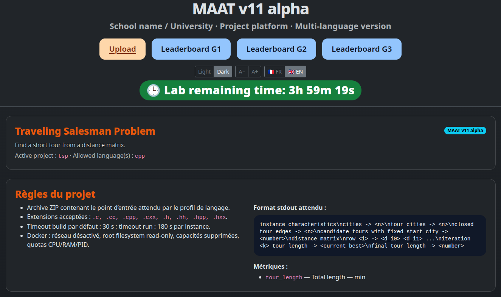

# MAAT v11

MAAT is a lightweight teaching platform for programming labs and mini-projects: students upload ZIP archives, MAAT compiles and runs them in Docker, extracts metrics from stdout, displays live leaderboards, and exports session results.

[Version française](README.fr.md)



## Highlights

- **Cross-platform teacher workflow**: primarily Linux, with possible use through WSL/macOS depending on Docker and Cloudflare support.
- **Bilingual UI**: French and English, selected in `config.json`.
- **Multi-language programming support**: declarative profiles for C++, Python and Java.
- **Simple deployment**: a local Flask server, Docker runners, and an optional Cloudflare tunnel.
- **Flexible and generic**: each project declares its data, instances, language(s), metrics and expected stdout format.
- **Low barrier for students**: they only upload a ZIP archive containing the expected entry point.
- **Fast to set up**: two complete example projects are included with data, sample solutions and uploadable ZIP archives.
- **Reasonable safety for supervised labs**: Docker isolation, CPU/RAM/PID limits, no network, read-only root filesystem, non-root user and pedagogical source filtering.

MAAT is not a multi-tenant SaaS platform, not a perfect sandbox, and not a full Moodle replacement. It is a single-machine teacher server for supervised teaching sessions.

## Quick start

From the bundle root:

```bash
./manage-maat.sh install
./manage-maat.sh check
./manage-maat.sh start
```

To expose MAAT to students through Cloudflare, run in another terminal:

```bash
./manage-tunnel.sh start
```

For a longer lab session, prefer:

```bash
./manage-tunnel.sh watch
```

The watch mode recreates the tunnel if the public URL stops responding. The script prints both the full Cloudflare URL and the shortened URL.

## Minimal configuration before starting

MAAT reads **`config.json`** at runtime. **`config.example.json`** is the clean template.

The main attributes to check in `config.json` are:

```json
"interface":
{
  "language": {"value": "en", "comment": "Default interface language: fr or en."}
},
"project":
{
  "active_project": {"value": "projects/tsp", "comment": "Path to the active MAAT project directory."}
},
"server":
{
  "listen_host": {"value": "0.0.0.0", "comment": "Network interface on which the Flask server listens."},
  "listen_port": {"value": 8000, "comment": "TCP port on which the Flask server listens."},
  "public_url":  {"value": "http://localhost:8000", "comment": "Public URL shown to users and in server summaries."},
  "admin_token": {"value": "CHANGE_ME", "comment": "Secret key required to open the administration page."}
}
```

Default active project: **`projects/tsp`**.

`manage-maat.sh` prints the local server URL, the admin URL and the admin token. `manage-tunnel.sh` prints the full public tunnel URL, the shortened URL and the `ntfy` notification information.

## Repository layout

```text
maat/
├── maat_app/                 # Flask application and evaluation core
├── templates/                # HTML templates
├── static/                   # CSS/JS
├── translations/             # generic FR/EN strings
├── languages/                # language profiles: cpp, python, java
├── docker/                   # Dockerfiles for runner images
├── projects/                 # teaching projects
│   ├── tsp/
│   │   ├── project.json
│   │   ├── data/
│   │   ├── documents/        # demo students, generated CSV, local state
│   │   ├── results/          # snapshots, exports, leaderboards
│   │   ├── sample_solution/
│   │   ├── submission/       # scripts + uploadable test ZIP
│   │   └── statement/
│   └── mnist_digits/
│       ├── project.json
│       ├── data/
│       ├── documents/
│       ├── results/
│       ├── sample_solution/
│       ├── submission/
│       └── statement/
├── scripts/                  # student generation, checks, packaging
├── config.json               # active local configuration
├── config.example.json       # configuration template
├── manage-maat.sh            # install, start, checks, projects
└── manage-tunnel.sh          # Cloudflare tunnel + watch + ntfy
```

Editable JSON files use the `value` / `comment` format. Comments are in English and only document the role of each attribute.

## Cloudflare tunnel

MAAT runs locally on the teacher machine. To make it reachable from student browsers, open a temporary Cloudflare tunnel:

```bash
./manage-tunnel.sh start
```

The script prints:

- the full `https://....trycloudflare.com` URL;
- a shortened URL, easier to copy or write on a board;
- `ntfy` information to receive phone notifications whenever a new public URL is published.

During a session, use:

```bash
./manage-tunnel.sh watch
```

This mode regularly checks the public URL and recreates the tunnel if needed. Share the tunnel URL with students through the board or your course channel.

## Administration access

After `./manage-maat.sh start`, the script displays the admin URL and the admin token. By default:

```text
http://127.0.0.1:8000/admin
```

When using a tunnel, append `/admin` to the public URL and enter the token printed by `manage-maat.sh`.

## Included projects

### `projects/tsp` — C++ / Traveling Salesman Problem

Goal: find a short tour from a distance matrix.

- **Allowed language**: C++.
- **Input**: a text file containing `n`, followed by an `n x n` distance matrix.
- **Sample algorithm**: exhaustive enumeration of permutations with a fixed start city, keeping the best tour seen so far.
- **Main parameters**: TSP instance, number of cities, distance matrix.
- **Expected output**: the program prints instance characteristics, the distance matrix, the tour-length progression at each iteration, then:

```text
final tour length -> <number>
```

- **Metric**: `tour_length`, summed over instances, minimized.
- **Uploadable UI test ZIP**: `projects/tsp/submission/tsp_cpp_sample_submission.zip`.
- **ZIP generation scripts**:

```bash
projects/tsp/submission/make_submission_linux.sh
projects/tsp/submission/make_submission_windows.bat
```

### `projects/mnist_digits` — Python / handwritten digit classification

Goal: classify MNIST-like handwritten digit images.

- **Allowed language**: Python.
- **Input**: CSV files `label,p0,...,p63`, representing 8x8 grayscale images.
- **Data**: offline MNIST-like digits dataset included in the bundle, with roughly a 2/3 training and 1/3 testing split.
- **Sample algorithm**: nearest class centroid with squared Euclidean distance.
- **Main parameters**: normalization mode, distance metric, number of centroids, number of progress checkpoints.
- **Expected output**: the program prints instance characteristics, algorithm parameters, accuracy progression, then:

```text
final accuracy -> <percentage>
```

- **Metric**: `accuracy`, averaged over instances, maximized.
- **Uploadable UI test ZIP**: `projects/mnist_digits/submission/mnist_python_sample_submission.zip`.
- **ZIP generation scripts**:

```bash
projects/mnist_digits/submission/make_submission_linux.sh
projects/mnist_digits/submission/make_submission_windows.bat
```

## Switching projects

List available projects:

```bash
./manage-maat.sh list-projects
```

Activate TSP:

```bash
./manage-maat.sh set-project tsp
```

Activate MNIST-like digits:

```bash
./manage-maat.sh set-project mnist_digits
```

Create a new project skeleton:

```bash
./manage-maat.sh new-project my_project
```

## Security and demo data

The `students.xlsx` files included in each project are **fictional**. They are only meant to test token generation, submissions and leaderboards.

MAAT runs untrusted code in Docker containers with:

- network disabled;
- Linux capabilities dropped;
- `no-new-privileges`;
- a non-root container user;
- read-only root filesystem;
- `/tmp` mounted as `tmpfs`;
- CPU, RAM and process-count limits;
- compilation and execution timeouts;
- pedagogical filtering of dangerous source-code patterns.

These mechanisms reduce risk but do not provide an absolute security guarantee against a determined attacker. Use MAAT on a teacher-controlled machine in a supervised teaching context.

## Phone notifications with ntfy

In `config.json`, check:

```json
"tunnel":
{
  "notifications_enabled": {"value": true, "comment": "Enable ntfy notifications for tunnel status changes."},
  "ntfy_server":           {"value": "https://ntfy.sh", "comment": "ntfy server used to send tunnel notifications."},
  "ntfy_topic":            {"value": "CHANGE_ME", "comment": "ntfy topic receiving notifications on a phone."}
}
```

On the phone: install the ntfy app, add a subscription, enter the server and topic printed by the scripts, and keep the topic private.

## Runtime artifacts

Generated results, snapshots, documents and SQLite databases are project-local:

```text
projects/<project_id>/documents/
projects/<project_id>/results/
```

Temporary runtime directories are at the bundle root:

```text
submissions/
runs/
logs/
```

`./manage-maat.sh uninstall` stops/removes MAAT containers and removes regenerable runtime directories such as `logs`, `runs` and `submissions`.

## License and contribution

The bundle includes `LICENSE`, `SECURITY.md`, `CONTRIBUTING.md` and `CHANGELOG.md`. Before publishing a public repository, verify the selected license and replace any local sensitive value from `config.json`.
